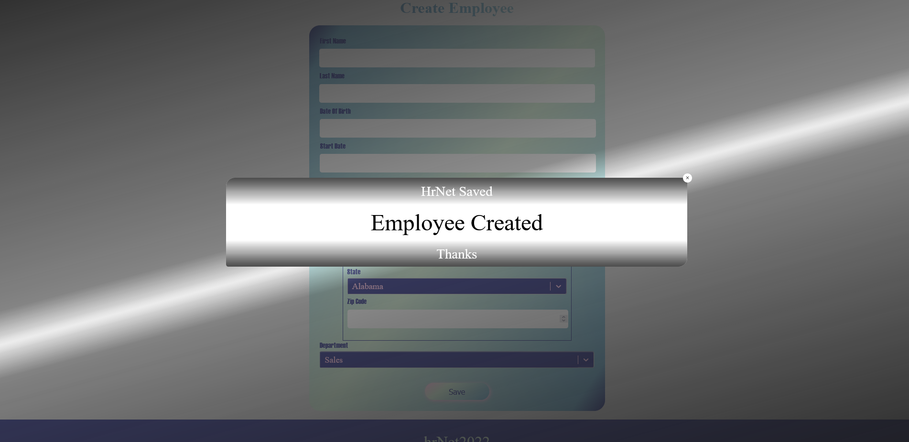

# dk_modale_package

dk_modale_package is a styleable validation modal imported into your react projects

#### EXAMPLE OF A STYLIZED RENDERING



## Installation

`npm i dk_modale_package`

##

## Usage

This package is made for use in a react application like a registration form

#### Example

```
import React, { useState } from "react"
import { Modal } from "dk_modale_package"

const form = () => {

  // !! REQUIRED !! variable to know the modal status (open or close)
  let [modalIsOpen,setModalIsOpen] = useState(false)

  // !! REQUIRED !! function to open or close the modal
  const toggleModal = () => {
    modalIsOpen ? setModalIsOpen(false) : setModalIsOpen(true)
  }

  //optionnal style of header
  const headerStyle = {
    background: "linear-gradient(rgba(0,0,0,0.7) , white )",
    fontSize: "32px",
    height: "4vh",
    color: "white",
  }

  //optionnal style of modal container
const modalContainerStyle = {
    background: "white",
    fontSize: "48px",
    color: "black",
    height: "15vh",
  }

  //optionnal style of background modal container
 const backgroundModalContainerStyle = {
    background:
      "linear-gradient(165deg,rgba(27,27,27,0.9) 0%,rgba(27,27,27,0.5) 45%, rgba(255,255,255,0.1) 50%,rgba(27,27,27,0.5) 55%,rgba(27,27,27,0.9) 100%)",
  }

  //optionnal style of footer
 const footerStyle = {
    background: "linear-gradient(white , rgba(0,0,0,0.7))",
    fontSize: "32px",
    color: "white",
    height: "4vh",
  }


  const modaleMsg = "Employee Created" // !! REQUIRED !! message to display in modal
  const headerMsg = "HrNet Saved" // message to display in header
  const footerMsg = "Thanks" //message to display in footer

  return (
    <main id="container">
      <Modal
        status={modalIsOpen} // true if open false if close
        modalMessage={modaleMsg}
        toggleModal={toggleModal}
        headerStyle={headerStyle}
        headerMsg={headerMsg}
        footerStyle={footerStyle}
        footerMsg={footerMsg}
        modalContainerStyle={modalContainerStyle}
        backgroundModalContainerStyle={backgroundModalContainerStyle}
      />
      <button onClick={() => toggleModal()} /> // Simulates submitting a form, in real react project toggle modal will be called in a form component when it will be submitted

    </main>
  )
}


```
